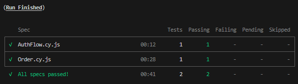
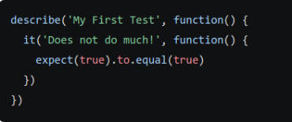
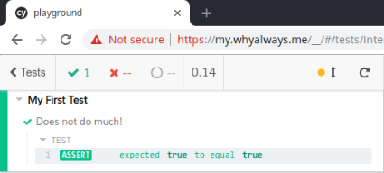
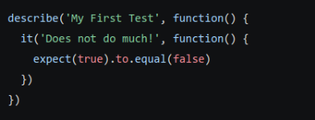
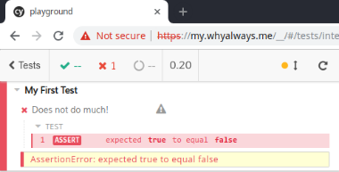
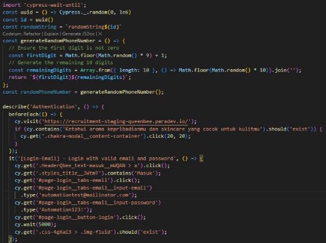
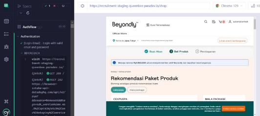

**CYPRESS**

Cypress adalah alat pengujian front end generasi berikutnya yang dibuat untuk web modern. Cypress paling sering dibandingkan dengan Selenium. Namun Cypress berbeda secara fundamental dan arsitektur. Cypress tidak dibatasi oleh batasan yang sama dengan Selenium. Ini memungkinkan Anda untuk menulis tes yang lebih cepat, lebih mudah, dan lebih andal.

1. **How To Install**
- $ cd /your/project/path
- $ npm init
- $ npm install cypress --save-dev
2. **How To Open Cypress**
- $./node\_modules/.bin/cypress open

**OR**

- **Run command from yourproject root**
- $ npx cypress open

Setelah melakukan command tersebut maka akan muncul Cypress Test Runner yang menampilkan daftar tes Integrasi.

3. **Create YourFirst File**
- Create your js file in cypress/e2e

Setelah membuat file di cypress/e2e, kamu akan melihat Cypress Test Runner menampilkan file baru yang kamu buat. Cypress memonitor file kamu untuk setiap perubahan dan secara otomatis menampilkan perubahan yang terjadi. Untuk melihat test yang kamu tulis, kamu bisa click file tes kamu di Cypress Test Runner dan Cypress akan memunculkan browser yang berisi test kalian.

4. **How To Run Cypress Without Open Test Runner**
- **Run command from yourproject root**
- $ npx cypress run

Dengan menjalankan command diatas semua file cypress yang berada pada cypress/e2e akan dijalankan secara berurutan. Berikut ini merupakan contoh hasil cypress run yang akan anda lihat:

5. **Write YourFirst Testing File**
- Sekarang mari kita tulis tes sukses pertama kita.
- Tulis Script ini di file js yang sudah kamu buat sebelumnya

  

- Save file kamu dan cypress browser akan mereload halamanmu dan memunculkan hasil tes dari script yang sudah kamu tulis.

  

- Sekarang mari kita tulis tes gagal pertama kita.
- Tulis Script ini di file js yang sudah kamu buat sebelumnya

  

- Save file kamu dan cypress browser akan mereload halamanmu dan memunculkan hasil tes dari script yang sudah kamu tulis.

  

- Setelah kita mengetahui hasil yang akan keluar jika sukses dan gagal mari kita mencoba membuat testing code untuk mengakses halaman user site beyondly.
- Tulis script ini

  

- Save file kamu dan cypress browser akan mereload halamanmu dan memunculkan hasil tes dari script yang sudah kamu tulis.

  

Setelah menjalankan test tersebut maka halaman kalian akan meredirect ke halaman

PCP Beyondly.
